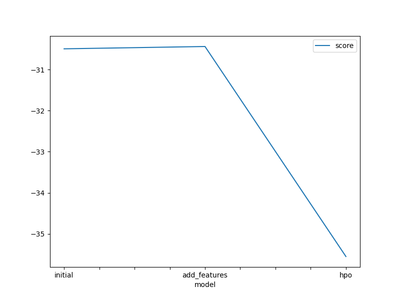

# Bike Sharing Demand Prediction with AutoGluon

## Overview

This project aims to predict bike sharing demand using AutoGluon, a powerful automated machine learning tool. The process involves data preprocessing, feature engineering, model training, and hyperparameter optimization to achieve accurate predictions.

## Table of Contents

- [Environment Setup](#environment-setup)
- [Data Preparation](#data-preparation)
- [Model Training and Evaluation](#model-training-and-evaluation)
- [Results and Visualizations](#results-and-visualizations)
- [Files Included](#files-included)
- [Conclusion](#conclusion)

## Environment Setup

To replicate the environment and run this project, follow these steps:

1. Install necessary libraries:
   ```bash
   pip install -U pip
   pip install -U setuptools wheel
   pip install -U "mxnet<2.0.0" bokeh==2.0.1
   pip install autogluon --no-cache-dir
   ```

2. Configure Kaggle API:
   - Obtain your Kaggle API key and set up `kaggle.json` in `/root/.kaggle/`.

3. Download and unzip the dataset:
   ```bash
   pip install kaggle
   kaggle competitions download -c bike-sharing-demand
   unzip -o bike-sharing-demand.zip
   ```

## Data Preparation

### Explore and Prepare Dataset

- Load and explore the dataset using pandas.
- Visualize data distributions and correlations to understand the features.

## Model Training and Evaluation

### Baseline Model

- Train a baseline model using AutoGluon.
- Evaluate model performance with root mean squared error (RMSE).

### Feature Engineering

- Extract datetime features (year, month, day, hour, dayofweek) from the dataset.
- Re-train the model with additional features to improve prediction accuracy.

### Hyperparameter Optimization (HPO)

- Fine-tune model hyperparameters using AutoGluon's HPO capabilities.
- Optimize parameters such as number of boosting rounds and learning rate.

## Results and Visualizations

### Model Performance

- Plot the improvement in model training and test scores.
  


### Hyperparameter Table

- Summary table showing key hyperparameters and their impact on model performance.

| Model           | Num Boost Rounds | Num Trials | Num Epochs | Score |
|-----------------|------------------|------------|------------|-------|
| Initial         | Default          | Default    | 100        | 1.80474 |
| Add Features    | Default          | Default    | 15         | 0.6423  |
| HPO             | 110              | 16         | 14         | 0.47665 |

## Files Included

- `Bike_Sharing_Demand_with_Sagemaker.ipynb`: Jupyter notebook with complete code and explanations.
- `report.md`: Showing the understanding and learning results of the project.
- `model_train_score.png`, `model_test_score.png`: Visualizations of model training and test scores.

## Conclusion

This project showcases the effectiveness of AutoGluon in predicting bike sharing demand, leveraging feature engineering and hyperparameter optimization to achieve significant improvements in model accuracy.

For detailed code implementation and further insights, refer to the Jupyter notebook (`Bike_Sharing_Demand_with_Sagemaker.ipynb`) and accompanying files.

