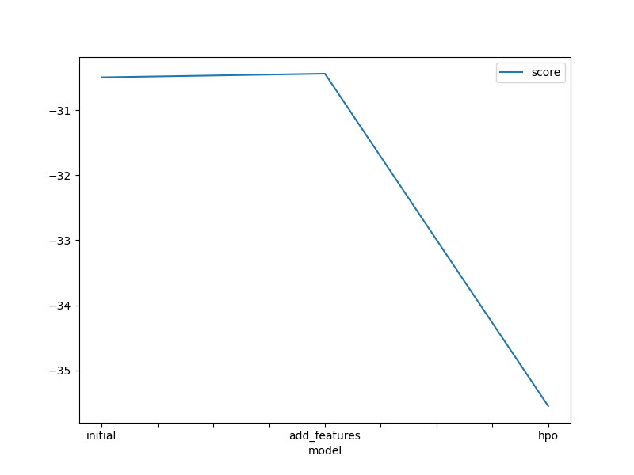
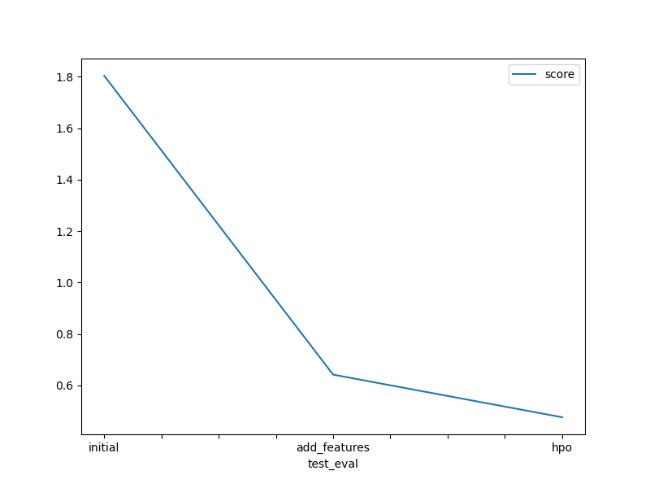

# Report: Predict Bike Sharing Demand with AutoGluon Solution
#### Gyanavardhan Mamidisetti

## Initial Training
### What did you realize when you tried to submit your predictions? What changes were needed to the output of the predictor to submit your results?
During the initial submission, encountering errors prompted the addition of extra features for the second submission, followed by parameter optimization for the third. Throughout this process, exploratory analysis was conducted, refining strategies along the way. Kaggle's submission guidelines necessitated the replacement of negative prediction values generated by the predictors with zeroes.

### What was the top ranked model that performed?
The top ranked model in all the 3 experiments is WeightedEnsemble_L3.

## Exploratory data analysis and feature creation
### What did the exploratory analysis find and how did you add additional features?
I expanded the dataset by including new features like month, day, hour, and year using datetime. Additionally, I categorized variables such as season and weather. To gain insights, I employed data visualization techniques.

### How much better did your model preform after adding additional features and why do you think that is?
The model showed notable performance enhancements, especially during hyperparameter optimization (HPO). Breaking down the date into separate components played a crucial role, helping the model identify and utilize seasonal patterns effectively. By adding these temporal attributes to the feature set, the model improved its predictive abilities, leading to better classifications and more precise estimations of the target value.

## Hyper parameter tuning
### How much better did your model preform after trying different hyper parameters?
The hyperparameter tuning did make a noticeable contribution. Certain configurations proved particularly beneficial during model validation, demonstrating their usefulness in enhancing overall performance.

### If you were given more time with this dataset, where do you think you would spend more time?
I would focus on a combination of more visualization techniques, striving for increased accuracy. Specifically, I'd invest effort into creating heatmaps and scatter plots to gain deeper insights into the data distribution and relationships between variables. Furthermore, I would dedicate time to further optimize hyperparameters, exploring a wider range of configurations to fine-tune model performance. Additionally, I'd extend the training duration and increase the number of iterations to allow the model to learn from more instances and refine its predictive capabilities.

### Create a table with the models you ran, the hyperparameters modified, and the kaggle score.
|         model | num_boost_round | num_trials | num_epochs |    score |
|--------------|-----------------|------------|------------|----------|
|       initial |         default |    default |    default |  1.80474 |
|  add_features |         default |    default |    default |  0.64230 |
|        hpov1  |             100 |         15 |         14 |  0.47665 |
|        hpov2  |             110 |         16 |         15 |  0.47094 |

### Create a line plot showing the top model score for the three (or more) training runs during the project.

### Create a line plot showing the top kaggle score for the three (or more) prediction submissions during the project.

## Summary
Throughout this project, I effectively applied the concepts from our course unit to build a regression model using the AutoGluon framework. With the skills I've acquired, I crafted a sturdy model that showed promising performance, reflected in a commendable Kaggle score. This practical experience not only deepened my grasp of machine learning methods but also offered valuable insights into real-world applications. Overall, I found this project immensely rewarding, both in terms of knowledge gained and accomplishments achieved.
